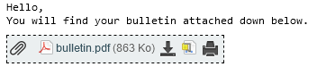

# **PolyBulletin**

This script will check the Polytechnique Montreal student dossier on a regular basis for changes in final grades.

Changes will be sent to you via email.

## **Setup**

**Install the dependencies:**

- Install libraries with `python install_dependencies.py`

**Setup the authentifications:**

- Fill the `Login_FILL_ME.cfg` file
- Rename it to `Login.cfg`

## **Running**

`python poly_bulletin.py`

The program will check for final grades every 15 minutes (can be changed in the `main loop` function in `poly_bulletin.py`) and sleep the rest of the time.

Email will be sent form horde to any email of your choosing

## **Email Preview**

Example from horde

**Many thanks to:**

* [Nick]
* [Charles De Lafontaine] for providing `taste_the_rainbow.py`

[Nick]:https://github.com/niroyb
[Charles De Lafontaine]:https://github.com/DaddyChucky